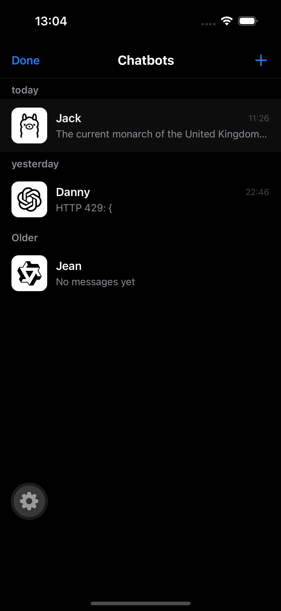
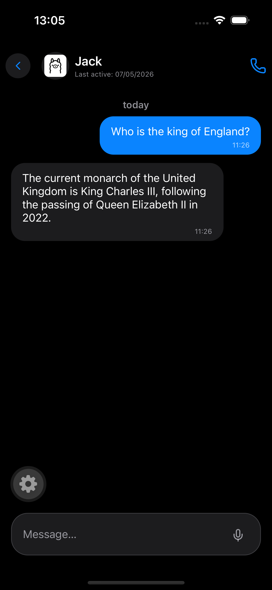
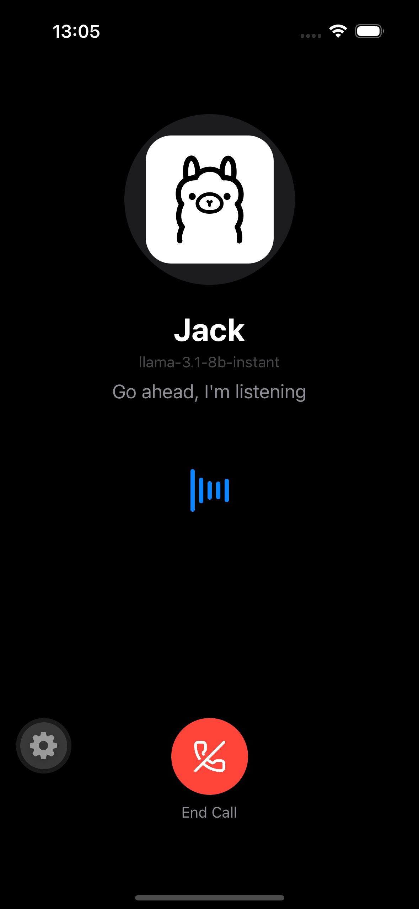
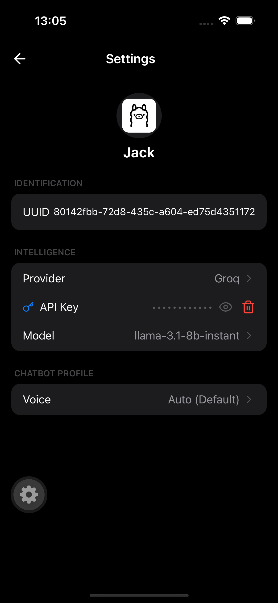

# Soren

Soren is a mobile AI chat app for fast text conversations and natural voice calls with your chatbot.

  <table border="0">
    <tr>
      <td></td>
      <td></td>
    </tr>
    <tr>
      <td></td>
      <td></td>
    </tr>
  </table>

## Why Soren

Soren focuses on everyday conversation flow: quick replies, clean chat history, and easy profile switching for different assistant personalities.

## What You Can Do

- Chat in real time with streaming AI responses.
- Start a voice session and talk naturally, hands-free style.
- Create multiple chatbot profiles for different use cases.
- Pick your preferred AI provider and model.
- Supports OpenAI, Groq, Google Gemini, Anthropic, Hugging Face, Ollama Cloud.
- Choose a voice for spoken responses.
- Bring your own API key and keep your setup personal.

## How It Feels

- **Text mode**: fast message loop with a familiar chat UI.
- **Voice mode**: listen -> think -> speak flow designed for back-and-forth conversation.
- **Profile mode**: switch between chatbots without losing each bot's context.

## Privacy & Data

Soren is local-first for chatbot configuration and conversation history on device.  
API keys are stored securely on device storage.

## Project Docs (Maintainers)

For implementation details and contributor workflows:

- [Architecture](docs/architecture.md)
- [Development Runbook](docs/development.md)
- [Testing Runbook](docs/testing.md)
